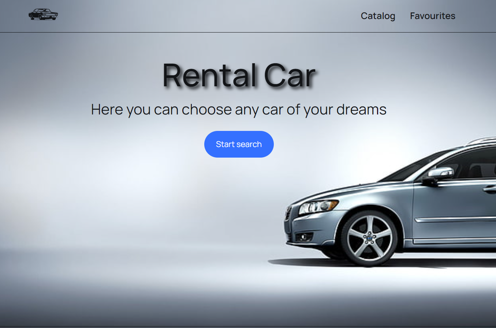
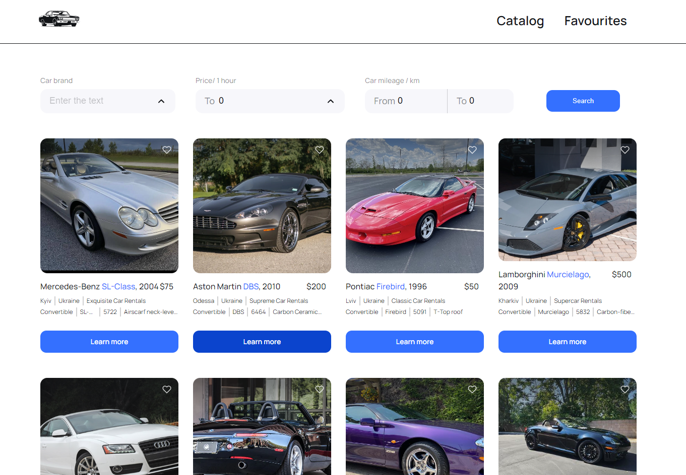
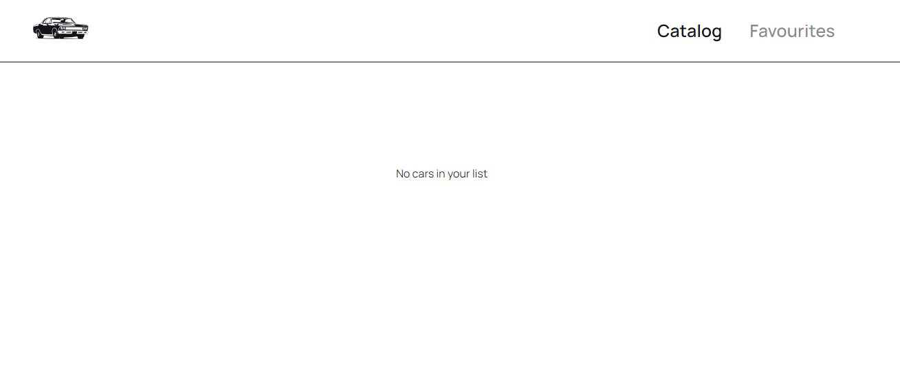
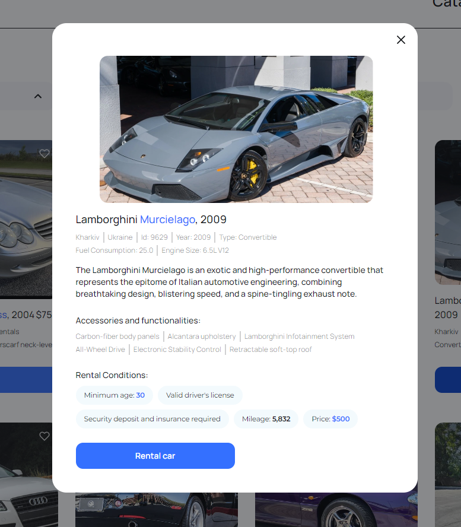

# Rent-car application

Test task project

Technology stack - [React, JS, CSS modules, Redux, Axios, REST API]

Feature - Adaptive design

API Requests are made to the mockapi.io service, where a mini back-end has been deployed for this project.

About
RENT-CAR is an application for people who are looking for a rental car.

Overwiev
The base URL address of the application always welcomes users.

Catalog page where you can view the entire list of available cars for rent.

The Favorites page is a place filled by the user himself.

A modal window opens when you click on the Learn more about car button. It allows users to see detailed information about the car.
